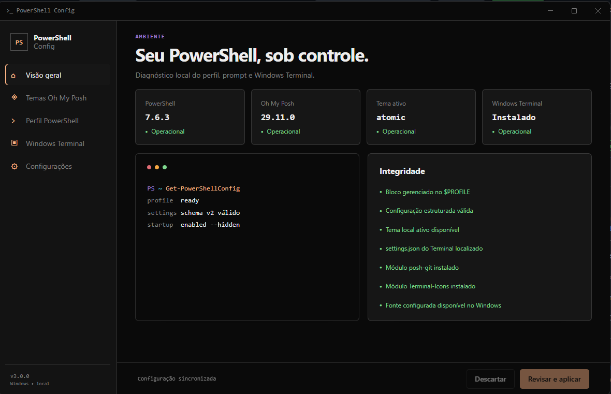
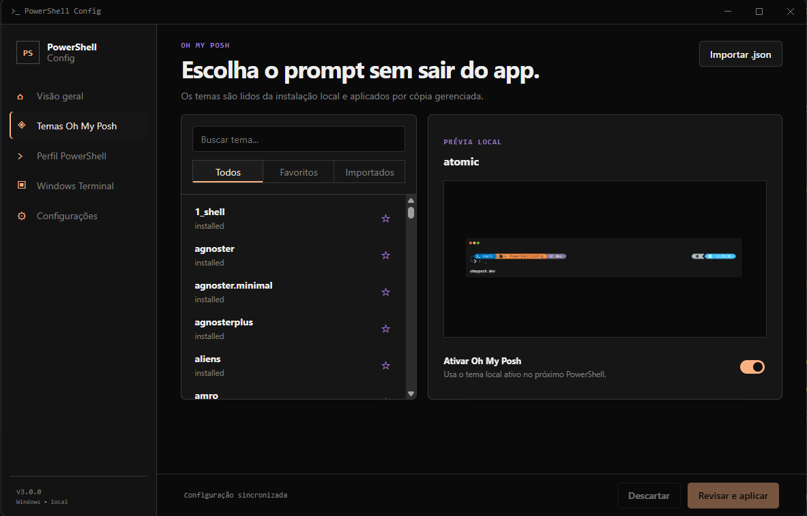
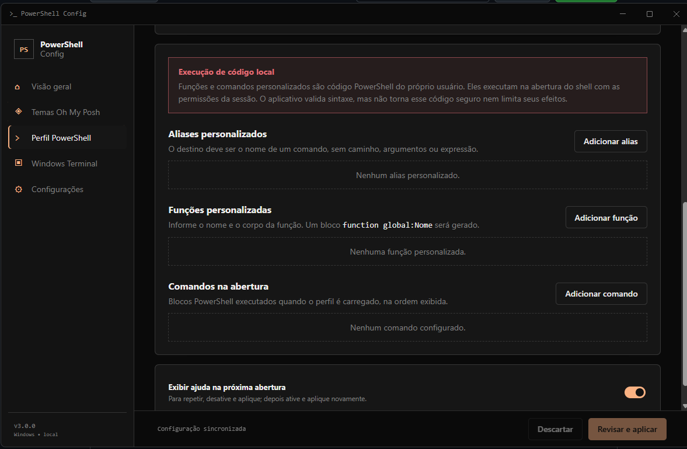
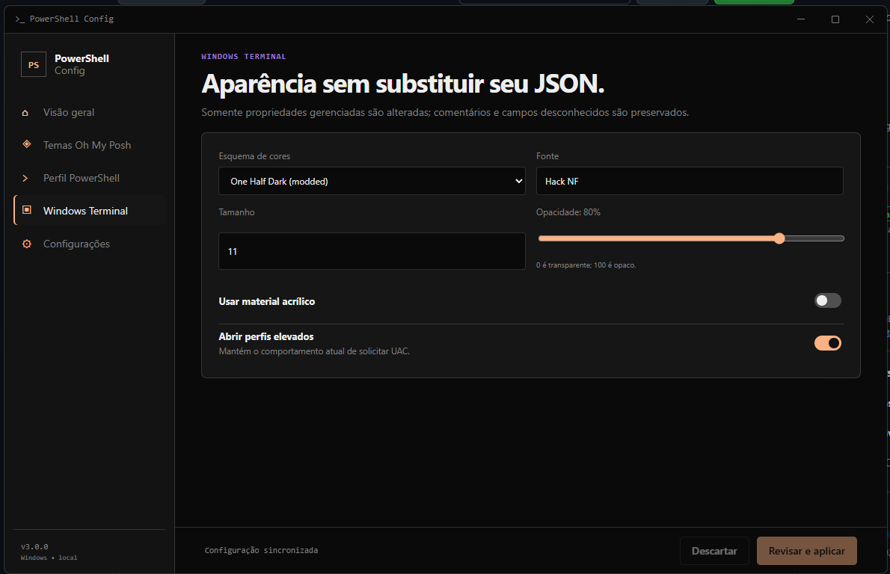
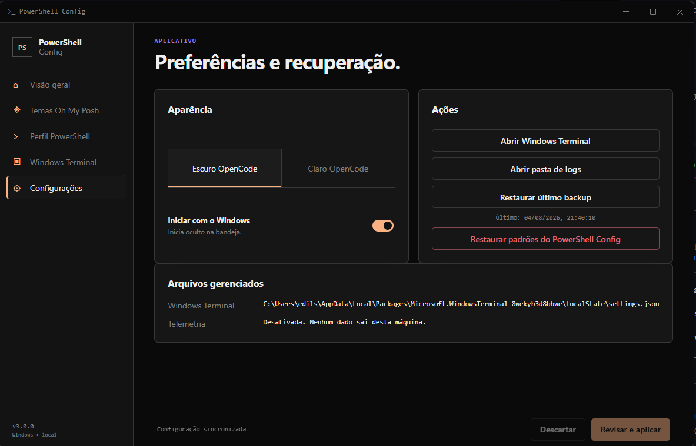
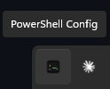

# PowerShell Config

Instalador e aplicativo desktop para configurar um ambiente PowerShell moderno no Windows sem editar arquivos manualmente. O projeto instala as dependências necessárias, diagnostica o ambiente e permite administrar o perfil, os temas do Oh My Posh e a aparência do Windows Terminal por uma interface local.



## Principais funcionalidades

- Instala ou atualiza PowerShell 7, Windows Terminal, Oh My Posh, Git e Neovim.
- Instala os módulos `posh-git`, `Terminal-Icons` e `PSReadLine`, além da fonte Hack Nerd Font.
- Exibe o estado do ambiente e identifica configurações ausentes.
- Permite escolher, pesquisar, favoritar e importar temas do Oh My Posh.
- Administra opções do perfil, aliases, funções e comandos personalizados.
- Ajusta esquema de cores, fonte, tamanho, opacidade, acrílico e elevação do Windows Terminal.
- Aplica alterações com validação, backup, controle de conflito e restauração.
- Funciona localmente, sem telemetria e sem carregar páginas remotas no aplicativo.

## Requisitos e instalação

### Sistemas suportados

- Windows 10 22H2, build 19045 ou superior.
- Windows 11.
- Arquiteturas x64 e ARM64.
- Internet e WinGet, distribuído pelo App Installer do Windows.

O instalador é executado por usuário e mantém os arquivos gerenciados em `%LOCALAPPDATA%\PowerShellConfig`.

### Instalação

1. Acesse a página de [GitHub Releases](https://github.com/edilsonvilarinho/powershell-config/releases).
2. Baixe o instalador correspondente à arquitetura do Windows e o arquivo `.sha256` associado:
   - `PowerShellConfig-Setup-X.Y.Z-win-x64.exe`
   - `PowerShellConfig-Setup-X.Y.Z-win-arm64.exe`
3. Valide o SHA-256 do executável.
4. Feche completamente o Windows Terminal, inclusive o processo mantido na bandeja.
5. Execute o instalador e abra o PowerShell Config pelo menu Iniciar ou pela opção exibida ao final.

Instalação silenciosa:

```powershell
.\PowerShellConfig-Setup-X.Y.Z-win-x64.exe /S
```

Se o Windows Terminal estiver em execução, o instalador interrompe o preflight sem encerrar processos, sessões ou extrair arquivos. O diagnóstico da tentativa fica disponível em `%LOCALAPPDATA%\PowerShellConfig\logs`.

## Aplicativo

<table>
  <tr>
    <td width="50%">
      <strong>Temas Oh My Posh</strong><br>
      <sub>Busca, favoritos, importação e prévia local.</sub><br><br>
      
    </td>
    <td width="50%">
      <strong>Perfil PowerShell</strong><br>
      <sub>Opções conhecidas, aliases, funções e comandos de abertura.</sub><br><br>
      
    </td>
  </tr>
  <tr>
    <td width="50%">
      <strong>Windows Terminal</strong><br>
      <sub>Aparência gerenciada sem substituir o arquivo JSON.</sub><br><br>
      
    </td>
    <td width="50%">
      <strong>Configurações</strong><br>
      <sub>Tema do aplicativo, inicialização, logs e recuperação.</sub><br><br>
      
    </td>
  </tr>
</table>

O aplicativo permanece disponível na bandeja e inicia oculto com o Windows quando essa opção está habilitada. Fechar a janela apenas a oculta; a opção **Sair** encerra o processo.

<p align="center">
  
</p>

## Segurança e recuperação

- O perfil existente recebe somente um bloco gerenciado pelo projeto.
- O `settings.json` do Windows Terminal é mesclado sem remover comentários ou propriedades externas.
- Cada aplicação cria backup e usa gravação atômica.
- Alterações externas detectadas durante uma edição bloqueiam a gravação até o recarregamento.
- A restauração reverte somente propriedades gerenciadas, e a desinstalação remove apenas o estado controlado pelo PowerShell Config.
- PowerShell, Windows Terminal, Git, Neovim, Oh My Posh e módulos instalados não são removidos nem rebaixados.

> [!WARNING]
> Funções e comandos personalizados são código PowerShell fornecido pelo usuário e executado com as permissões da sessão. A validação de sintaxe não funciona como sandbox nem garante o comportamento desse código.

<details>
<summary><strong>Desenvolvimento local</strong></summary>

### Testes e build

```powershell
pwsh -NoLogo -NoProfile -ExecutionPolicy Bypass -File .\installer\scripts\Test-PowerShellConfig.ps1
Push-Location .\desktop
npm ci
npm test
npm run build
Pop-Location
```

Smoke test do aplicativo empacotado:

```powershell
.\desktop\scripts\smoke-packaged.ps1 `
  -ExecutablePath '.\desktop\dist-build\x64\win-unpacked\PowerShell Config.exe' `
  -RepositoryRoot .
```

O ambiente de desenvolvimento requer Node.js 24 e npm. A criação do instalador também requer NSIS.

</details>

<details>
<summary><strong>Release</strong></summary>

A versão do instalador fica em `installer/version.nsh`. Tags `v*` executam o workflow `.github/workflows/release-windows.yml`, que testa, empacota e publica instaladores x64 e ARM64 com seus respectivos SHA-256.

Validar uma release sem alterar o repositório:

```powershell
powershell -NoProfile -ExecutionPolicy Bypass -File .\.codex\skills\powershell-config-release\scripts\release_powershell_config.ps1 -RepoPath C:\Users\edils\workspace\powershell-config -ReleaseType patch -ValidateOnly
```

Publicar uma release:

```powershell
powershell -NoProfile -ExecutionPolicy Bypass -File .\.codex\skills\powershell-config-release\scripts\release_powershell_config.ps1 -RepoPath C:\Users\edils\workspace\powershell-config -ReleaseType patch
```

Tipos aceitos: `patch`, `minor` e `major`.

</details>

## Limites de validação

O pipeline valida scripts, testes, o aplicativo Electron x64 empacotado, payloads x64/ARM64 e a compilação NSIS. O aceite completo do instalador ainda exige testes em máquinas virtuais limpas com:

- Windows 10 22H2 x64.
- Windows 11 x64.
- Windows 11 ARM64.

Falhas relacionadas a WinGet, proxy, UAC, GPO e configurações inválidas do Windows Terminal também precisam ser exercitadas nesses ambientes.
